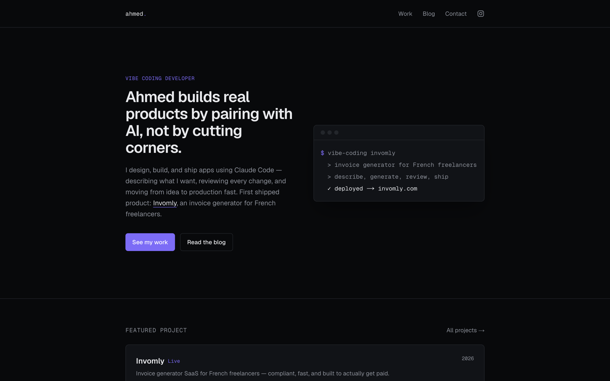

# Ahmed.Ibrahim Vibe Coding — portfolio

Personal site: hero, portfolio, blog, Instagram link, contact. Dark, terminal-inspired design. Next.js (App Router) + TypeScript + Tailwind, deployed on Vercel.



Live at [ahmed-portfolio-lake-one.vercel.app](https://ahmed-portfolio-lake-one.vercel.app)

## Editing your identity

Edit `lib/site-config.ts` — name, tagline, email, and **Instagram handle** (currently a placeholder, `yourhandle` — update it before deploying).

## Adding a project

Add a new `.mdx` file to `content/projects/`, e.g. `content/projects/my-app.mdx`:

```mdx
---
title: "My App"
summary: "One-line description."
tags: ["Tag1", "Tag2"]
stack: ["Next.js", "Vercel"]
liveUrl: "https://myapp.com"
year: "2026"
status: "Live"
featured: false
---

Case study body in Markdown/MDX goes here.
```

The homepage features whichever project has `featured: true`; `/projects` lists all of them, newest first.

## Adding a blog post

Add a new `.mdx` file to `content/blog/`, e.g. `content/blog/my-post.mdx`:

```mdx
---
title: "My Post"
date: "2026-08-08"
excerpt: "One-line summary shown in post lists."
tags: ["Tag1"]
---

Post body in Markdown/MDX goes here.
```

Posts sort by `date`, newest first. The two starter posts in `content/blog/` are placeholders — edit or delete them.

---

This is a [Next.js](https://nextjs.org) project bootstrapped with [`create-next-app`](https://nextjs.org/docs/app/api-reference/cli/create-next-app).

## Getting Started

First, run the development server:

```bash
npm run dev
# or
yarn dev
# or
pnpm dev
# or
bun dev
```

Open [http://localhost:3000](http://localhost:3000) with your browser to see the result.

You can start editing the page by modifying `app/page.tsx`. The page auto-updates as you edit the file.

This project uses [`next/font`](https://nextjs.org/docs/app/building-your-application/optimizing/fonts) to automatically optimize and load [Geist](https://vercel.com/font), a new font family for Vercel.

## Learn More

To learn more about Next.js, take a look at the following resources:

- [Next.js Documentation](https://nextjs.org/docs) - learn about Next.js features and API.
- [Learn Next.js](https://nextjs.org/learn) - an interactive Next.js tutorial.

You can check out [the Next.js GitHub repository](https://github.com/vercel/next.js) - your feedback and contributions are welcome!

## Deploy on Vercel

The easiest way to deploy your Next.js app is to use the [Vercel Platform](https://vercel.com/new?utm_medium=default-template&filter=next.js&utm_source=create-next-app&utm_campaign=create-next-app-readme) from the creators of Next.js.

Check out our [Next.js deployment documentation](https://nextjs.org/docs/app/building-your-application/deploying) for more details.
